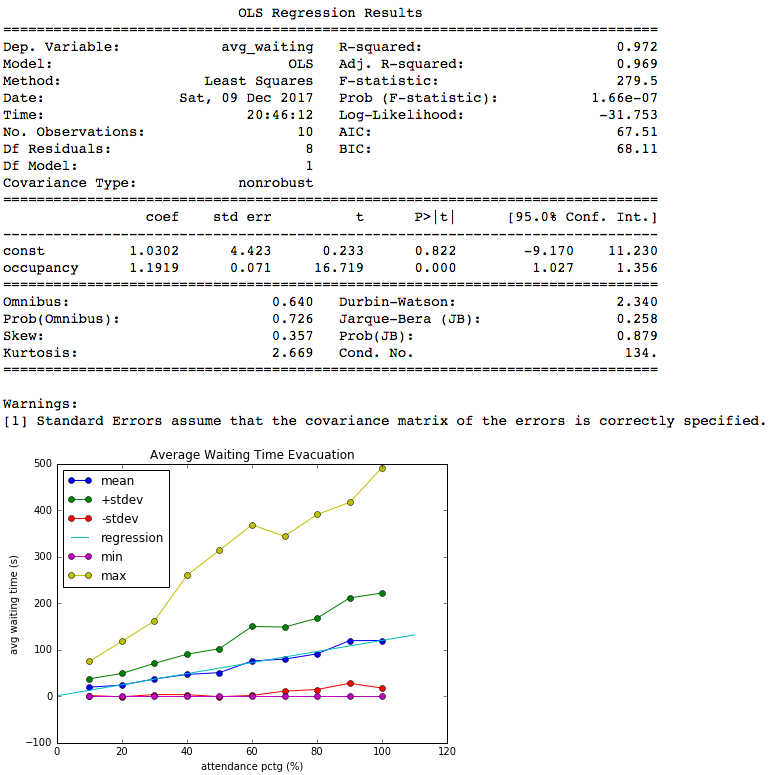
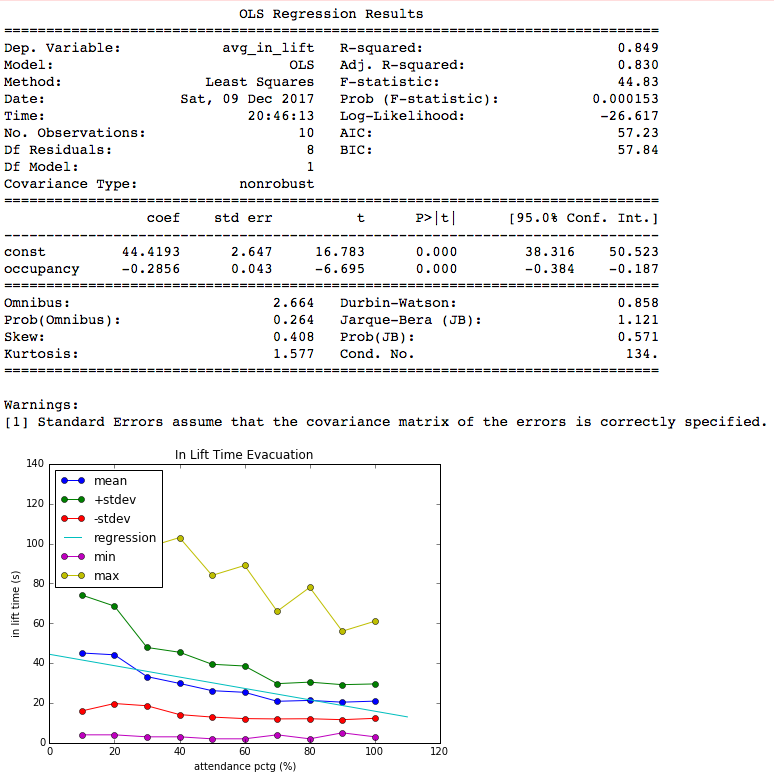
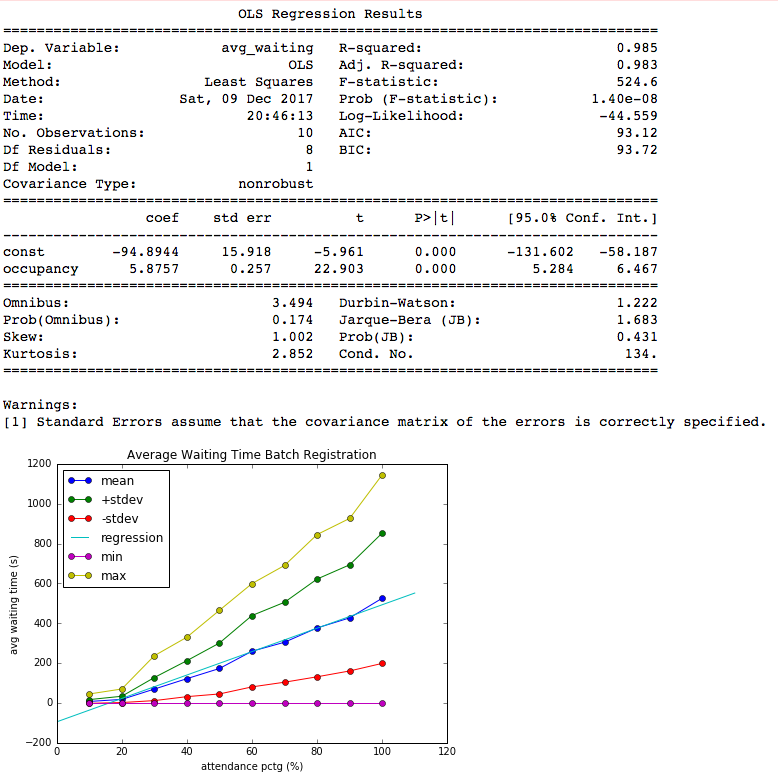
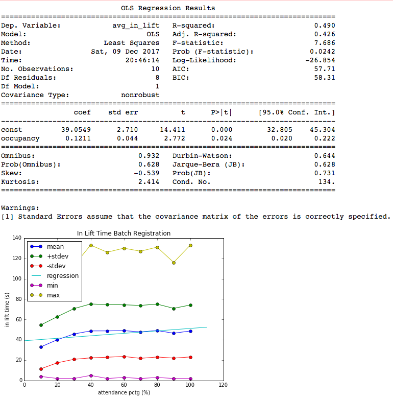
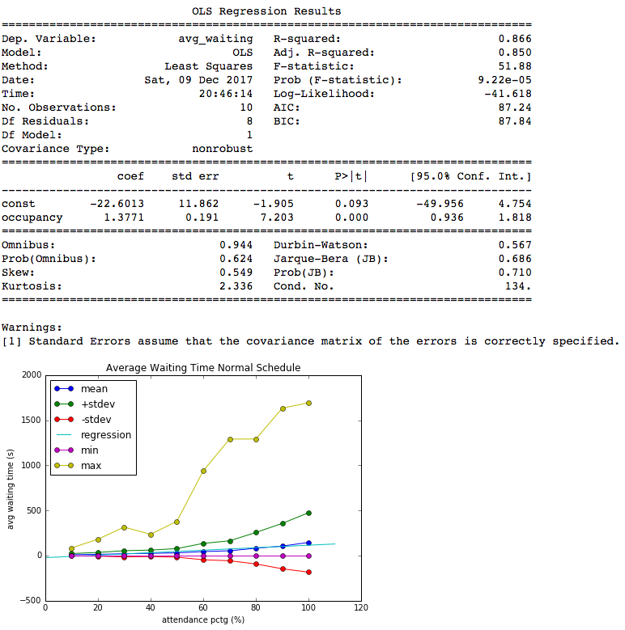
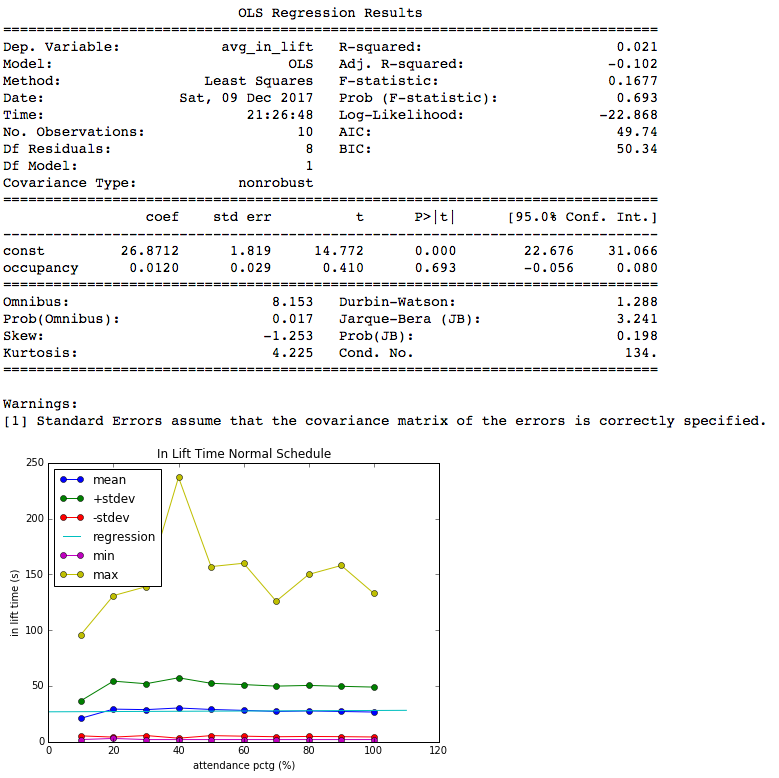

# Title: Hotel Lift Monte Carlo Simulation

## Team Member(s): nikolausn

# Monte Carlo Simulation Scenario & Purpose:
In this project, I tried to simulate the lifts traffic in a hotel. Often in the real world, we are asking about how long we must wait for a lift in order to get to our designated floor, how much travel time needed, and how the lift handle traffic queue in a busy time. In a hotel, the lift is an important feature for attendance or even hotel staffs. The usage of the hotel's lifts depends on how many guests are there in the hotel and how often they move between floors. 

To simulate the real world Hotel Lift, I make a program that can simulate a real-life situation. I build the code using an Object-Oriented method in which we can configure the environment of the hotel by using dictionary parameters. For example, we can configure how many floors that a hotel has, how many lifts, which floor that a lift serves, how many rooms for each floor, what are the room type and its capacity, how many people can a lift handle, etc. By using this complexity, I expect this code to be able to accommodate different scenarios.

For the simulation purpose, I tried to handle 3 different scenarios. Firstly, evacuation scenario, given the configuration in the particular hotel, we want to measure how long we can evacuate all the guest in the hotel room using lifts in the hotel. This scenario is useful to understand the effectiveness of the hotel lift configuration to handle evacuation and further can be used to develop a better queue or system for evacuation handling. Next, conference bulk check-in scenario, using the same configuration we will try to bring all the guest that comes at the random time to the designated floor. This scenario is useful to understand how long the attendance needs to spend the time to go to the designated floor in the busy situation. Finally, we can also try the real world lift usage by simulating people going in and out in a designated random time by configuring hotel occupancy and movement time.

### Hypothesis before running the simulation:
For the simulation purpose I used this following configuration:

Room Type:
- Single, Capacity: 2
- Double, Capacity: 2
- Deluxe, Capacity: 4

Hotel Floors: 20

Rooms every Floors:
- Single: 20
- Double: 20
- Deluxe: 10

Number of Lifts: 6
Configuration:
- 1: floor 0 - 19, speed 1 each floor
- 2: floor 0 - 19, speed 1 each floor
- 3: floor 0 - 9, speed 1 each floor
- 4: floor 0 - 9, speed 1 each floor
- 5: floor 10 - 19, speed 10 for 0 - 10, next speed 1 each floor
- 6: floor 10 - 19, speed 10 for 0 - 10, next speed 1 each floor

The time measure in this simulation is second, so we compute every single second for each object (Lift, and Guests) to measure they spending time.

Before running the simulation, I might use my hypothesis for every scenario:
- evacuation scenario: there is no relation within hotel occupancy and average waiting time and average in lift time in the evacuation scneario
- bulk check-in scenario: there is no relation within hotel occupancy and average waiting time and average in lift time in the evacuation scneario
- normal schedule scenario: there is no relation within hotel occupancy and average waiting time and average in lift time in the normal schedule scenario.

### Simulation's variables of uncertainty
There are several variables I used for the uncertainty:
- movement_waiting_time: is a movement parameter to produce a random variable of a person movement. Generating this random number will trigger the movement of a person after the designated time is reached. The waiting time itself is highly configurable and distributed in a Gaussian manner which skewed 2/3 to the left of the maximum time to simulate real-life behavior. The maximum waiting movement time can be configured in the json configuration file according to which schedule or what scenario we want to use
- door_closing_time: every time a lift door open in a floor, it has generated random waiting time to wait for another guest to get into the lift. This random waiting time is useful to simulate people behavior in a lift. People often push the close door button to close the lift immediately or just leave it closed automatically (maximum time). This variable is generated using normal Gaussian distribution with half of the maximum time as the mean. For this parameter, I used 10 seconds for the maximum door closing time
- assigned_schedule: attendances will be randomly assigned to a room and specific schedule according to the configuration file. To understand about the configuration more, look at the instructions on how to use the program

## Instructions on how to use the program:
To use the program, firstly we need to create a configuration file that contains parameter for the simulation, the sample scenario for normal schedule is given below
```
{
  "number_of_floor": 20,
  "lift_floor_configuration": {
    "0": {
      "floor": [0, 1, 2, 3, 4, 5, 6, 7, 8, 9, 10, 11, 12, 13, 14, 15, 16, 17, 18, 19],
      "speed": [1, 1, 1, 1, 1, 1, 1, 1, 1, 1, 1, 1, 1, 1, 1, 1, 1, 1, 1]
    },
    "1": {
      "floor": [0, 1, 2, 3, 4, 5, 6, 7, 8, 9, 10, 11, 12, 13, 14, 15, 16, 17, 18, 19],
      "speed": [1, 1, 1, 1, 1, 1, 1, 1, 1, 1, 1, 1, 1, 1, 1, 1, 1, 1, 1]
    },
    "2": {
      "floor": [0, 1, 2, 3, 4, 5, 6, 7, 8, 9],
      "speed": [1, 1, 1, 1, 1, 1, 1, 1, 1]
    },
    "3": {
      "floor": [0, 1, 2, 3, 4, 5, 6, 7, 8, 9],
      "speed": [1, 1, 1, 1, 1, 1, 1, 1, 1]
    },
    "4": {
      "floor": [0, 1, 2, 10, 11, 12, 13, 14, 15, 16, 17, 18, 19],
      "speed": [1, 1, 7, 1, 1, 1, 1, 1, 1, 1, 1, 1]
    },
    "5": {
      "floor": [0, 1, 2, 10, 11, 12, 13, 14, 15, 16, 17, 18, 19],
      "speed": [1, 1, 7, 1, 1, 1, 1, 1, 1, 1, 1, 1]
    }
  },
  "room_types_capacity": {"single": 2, "double": 2, "deluxe": 4},
  "rooms_floor_count": {"single": 20, "double": 20, "deluxe": 10},
  "scenario": [[[["room", 500], ["outside", 700], ["dining", 900], ["room", 0]], 0.5],
    [[["outside", 900], ["dining", 400], ["room", 0]], 0.3],
    [[["room", 400], ["dining", 900], ["conference", 300], ["room", 0]], 0.2]],
  "simulation_list": [[10, 0.1], [20, 0.2], [30, 0.3], [40, 0.4], [50, 0.5], [60, 0.6], [70, 0.7], [80, 0.8], [90, 0.9], [100, 1]],
  "attendance_log_name": "normal_attendance_{}.log",
  "lift_log_name": "normal_all_lift_{}.log",
  "thread_idle": 0.01,
  "iteration": 1}
```
with description as follow:
- number_of_floor: how many floors that we want to simulate
- lift_floor_configuration: is a dictionary containing configuration for a particular lift. For example:
```
"4": {
      "floor": [0, 1, 2, 10, 11, 12, 13, 14, 15, 16, 17, 18, 19],
      "speed": [1, 1, 7, 1, 1, 1, 1, 1, 1, 1, 1, 1]
    },
```
This will create a lift named "4" which serve the 0,1,2,10-19 floors and speed, 1 second for 0 to 1 and 1 to 2, and 7 seconds for 2-10 floor
- room_types_capacity: definition of room and their capacity (max attendance per room), for example:
```
  "room_types_capacity": {"single": 2, "double": 2, "deluxe": 4},
```
  means that single has 2 max attendance, double: 2 max attendance and deluxe 4 maximum attendance. However, the number of attendance each room will be randomly determined using gaussian distribution skewed right.
- rooms_floor_count: description of how many rooms for each floor, these rooms will be assigned for each floor according to number of floor configuration. For example:
```
"rooms_floor_count": {"single": 20, "double": 20, "deluxe": 10},
```
means that a floor will have 20 single room, 20 double room and 10 deluxe room
- scenario: scenario of people moving in the hotel and using the elevators. The scenario will contain the list of position with existing position and target position in the next element, and the waiting time which will be distributed using gaussian distribution. Furthermore, the percentage of people using this schedule will be determine in the second element of a schedule list. For example:
```
  "scenario": [[[["room", 500], ["outside", 700], ["dining", 900], ["room", 0]], 0.5],
    [[["outside", 900], ["dining", 400], ["room", 0]], 0.3],
    [[["room", 400], ["dining", 900], ["conference", 300], ["room", 0]], 0.2]],
```
this scheduler contains three scheduled scenarios, first people moving from the room to outside (500s waiting time) , outside to dining (700s waiting time), dining to the room (900s waiting time). This schedule will be used by 50% population of the attendance (randomly). and followed by the second schedule 30% population, and third schedule 20% population
-  simulation_list: contains a list of list which descibed as the name in the first element and the percentage of occupancy in the second element. For example:
```
  "simulation_list": [[10, 0.1], [20, 0.2], [30, 0.3], [40, 0.4], [50, 0.5], [60, 0.6], [70, 0.7], [80, 0.8], [90, 0.9], [100, 1]],
```
means that for the simulation we will run 10 occupancy scenarios from 10% to 100%
- attendance_log_name: the log name for the attendance log, use the curly bracket for the template name from the simulation list. For example:
```
"attendance_log_name": "normal_attendance_{}.log",
```
- lift_log_name: the log name for the lift log, use the curly bracket for the template name from the simulation list. For example:
```
"lift_log_name": "normal_all_lift_{}.log",
```
- thread_idle: the interval for the second granularity in the simulation. For example
```
"thread_idle": 0.01,
```
means that each second will be simulated for every 0.01s real time speed

After we define the scenario file we can run the program by using
```
python hotel_lift_monte_carlo.py -c <configuration_file>
```
The program will read the configuration file and produce the attendance log file with like this example below

```
AttendanceName,StartMovingTime,FromFloor,ToFloor,WaitingTime,InLiftTime,TotalSpendTime
485,1,24,1,0,4,19,23
1390,5,24,1,0,1,18,19
667,17,31,0,2,7,7,14
234,9,31,0,2,15,7,22
760,18,31,0,2,7,6,13
596,9,31,0,2,17,5,22
643,2,31,0,2,22,7,29
582,8,31,0,2,17,6,23
1019,8,34,2,0,10,16,26
122,1,34,5,0,8,25,33
```

## Hypothesis Testing
The full hypothesis testing can be seen in the Analysis.ipynb jupyter notebook file

# Evacuation Scenario
## Average Waiting Time


waiting_time = B0 + B1 * occupancy_percentage
Our Hypothesis for Average Waiting Time in the Evacuation Scenario:
- H0 -> B1 = 0 (there is no relation within occupancy percentage and average waiting time)
- H1 -> B1 != 0

Based on the statistic observation above, we can see that there is linear positive relation between increasing hotel occupancy and average lift waiting time. The linear model can be described by 1.03 + 1.19 * occupancy_percentage, means every increasing value of occupancy percentage the average lift waiting time will be increased by 1.19s.

Furthermore, the p_value for the slope (occupancy_percentage) is close to zero which describes that the linear model is highly significant to correlate occupancy percentage and average waiting time. Therefore, we reject our null hypothesis and accept the hypothesis there is significant positive linear relation within occupancy percentage and average waiting time. 
## Average In Lift Time


in_lift_time = B0 + B1 * occupancy_percentage
Our Hypothesis for Average In Lift Time in the Evacuation Scenario:
- H0 -> B1 = 0 (there is no relation within occupancy percentage and in lift time)
- H1 -> B1 != 0

Based on the statistic observation above, we can see that there is linear negative relation between increasing hotel occupancy and people stay in the lift while travel. The linear model can be described by 44.4193 - 0.2856 * occupancy_percentage, means every increasing value of occupancy percentage the spend time in lift in the evacuation scenario will be decreased by 0.2856 second.

Furthermore, the p_value for the slope is close to zero for 99% confidence interval,  which describes that the linear model is highly significant to correlate occupancy percentage and in lift time. Therefore, we reject our null hypothesis and accept the hypothesis there is significant negative linear relation within occupancy percentage and in lift time. 

# Batch Registration Scenario
## Average Waiting Time


waiting_time = B0 + B1 * occupancy_percentage
Our Hypothesis for Average Waiting Time in the Batch Registration Scenario:
- H0 -> B1 = 0 (there is no relation within occupancy percentage and average waiting time)
- H1 -> B1 != 0

Based on the statistic observation above, we can see that there is linear positive relation between increasing hotel occupancy and average lift waiting time in the batch registration scenario. The linear model can be described by -94.8944 + 5.8757 * occupancy_percentage, means every increasing value of occupancy percentage the average lift waiting time will be increased by 5.8757s.

Furthermore, the p_value for the slope is close to zero which describes that the coefficient is highly significant to associate occupancy percentage and average waiting time. Therefore, we reject our null hypothesis and accept the hypothesis there is significant positive linear relation within occupancy percentage and average waiting time. 

## Average In Lift Time


in_lift_time = B0 + B1 * occupancy_percentage
Our Hypothesis for Average In Lift Time in the Batch Registration Scenario:
- H0 -> B1 = 0 (there is no relation within occupancy percentage and in lift time)
- H1 -> B1 != 0

Based on the statistic observation above, we can see that there is linear positvie relation between increasing hotel occupancy and people spend time in the lift while travel. The linear model can be described by 39.0549 + 0.1211 * occupancy_percentage, means every increasing value of occupancy percentage the spend time in lift in the evacuation scenario will be increasing by 0.1211 second.

Furthermore, the p_value for the coefficient is 0.024 which is less than 0.05 for 95% confidence level. This describes that the coefficient is significant to correlate the occupancy percentage and in lift_time. Therefore, we reject our null hypothesis and accept the hypothesis there is positive linear relation within occupancy percentage and in lift time.

# Normal Schedule Scenario
## Average Waiting Time


waiting_time = B0 + B1 * occupancy_percentage
Our Hypothesis for Average Waiting Time in the Normal Schedule Scenario:
- H0 -> B1 = 0 (there is no relation within occupancy percentage and average waiting time)
- H1 -> B1 != 0

Based on the statistic observation above, we can see that there is linear positive relation between increasing hotel occupancy and average lift waiting time in the batch registration scenario. The linear model can be described by -22.6013 + 1.3771  * occupancy_percentage, means every increasing value of occupancy percentage the average lift waiting time will be increased by 1.3771 s.

Furthermore, the p_value for the slope is close to zero for 99% confidence level, which describes that the coefficient is highly significant to associate occupancy percentage and average waiting time. Therefore, we reject our null hypothesis and accept the hypothesis that there is significant positive linear relation within occupancy percentage and average waiting time. 

## Average In Lift Time


in_lift_time = B0 + B1 * occupancy_percentage
Our Hypothesis for Average In Lift Time in the Normal Schedule Scenario:
- H0 -> B1 = 0 (there is no relation within occupancy percentage and in lift time)
- H1 -> B1 != 0

Based on the statistic observation above, we can see that there no relation within the occupancy percentage and the In lift time for the normal schedule scenario. Although we can provide a linear model 26.8712 + 0.0120 * occupancy_percentage, the p_value for the slope is 0.693 which is higher than 0.05 (for 95% confidence interval).

Therefore for the in lift time in normal schedule scenario, we accept our null hypothesis and state that there is no significant relation within occupancy percentage and people spending time in lift

# Conclustion and Feature Work
In this project we can build a monte carlo simulation for the hotel lift. The simulation is highly configurable in which we can determine the variable and parameters for the hotel lift simulation freely. The program will generate data from the particular configuration scenario that we have determined before (evacuation, batch_registration, and normal schedule) with different hotel rooms occupancy. The data then analyzed further using the exploratory analysis and hypothesis testing.

In the future, we can elaborate the simulation code by projecting the real time data (weekly, daily, or hourly specific schedule). Next, we can also build the animation for the simulation process to better see the process. Finally we can also include different lift queue processing to determine which lift queue algorithm that is better to handle specific case.


## Sources Used:
- 9.6. random - Generate pseudo-random numbers¶. (n.d.). Retrieved November 28, 2017, from https://docs.python.org/2/library/random.html
- Monte Carlo method. (2017, November 20). Retrieved November 28, 2017, from https://en.wikipedia.org/wiki/Monte_Carlo_method
- (n.d.). Retrieved November 28, 2017, from https://pypi.python.org/pypi/pynput
- 16.2. threading - Higher-level threading interface¶. (n.d.). Retrieved November 28, 2017, from https://docs.python.org/2/library/threading.html
